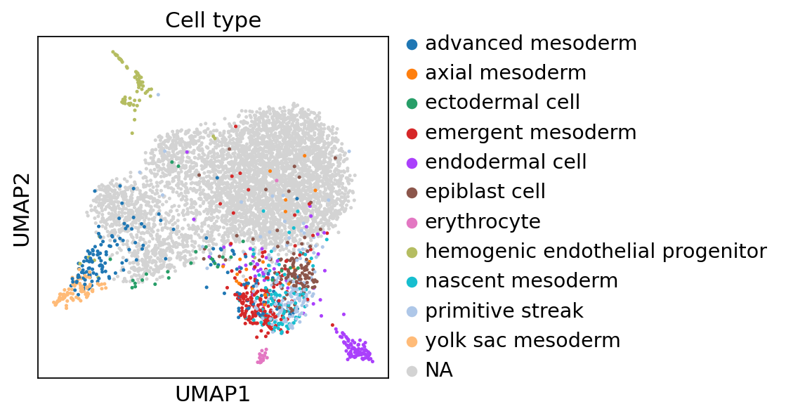
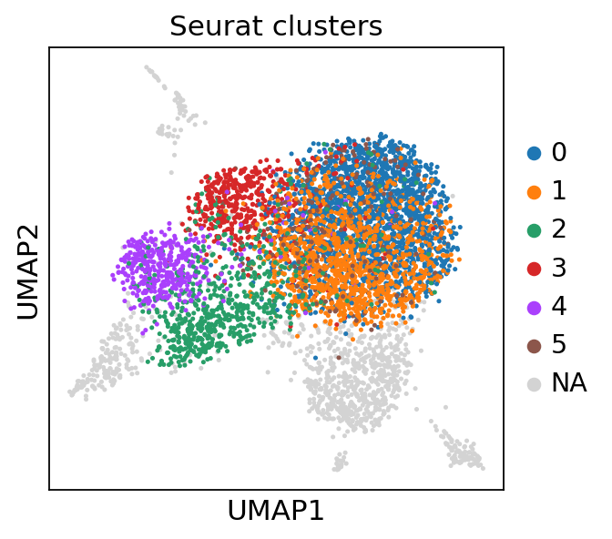

# Read me

This repository is part of the educational project for the "bpEXA" course at the Faculty of Bioinformatics, Leiden University of Applied Sciences.

## Description

The script in this repository is an adapted copy of the [basic tutorial for query-to-reference mapping using expiMap](https://docs.scarches.org/en/latest/expimap_surgery_pipeline_basic.html). The primary purpose of the script is to train a model to minimize batch effects in bioinformatics data.

## Requirements

To run the script with **scArches version 0.6.1**, you will need:

- A development environment with **Python 3.12**.

### Important Note

Starting from January 2025, errors may occur when installing **scArches** due to updates to its dependency libraries. Therefore, it is strongly recommended to use the `requirements.txt` file included in this repository to set up a virtual development environment and install all necessary dependencies.

## Installation

1. Ensure that Python 3.12 is installed on your system.
2. Create and activate a virtual environment:
    
    ```bash
    python3.12 -m venv venv
    source venv/bin/activate  # for Linux/MacOS
    venv\Scripts\activate  # for Windows
    ```
    
3. Install the dependencies from `requirements.txt`:
    
    ```bash
    pip install -r requirements.txt
    ```
    
## Updates
### Update 24.01.2025
During the work, it was discovered that when loading the `hiPSC.h5ad` file, the matrix `X` contains floating-point values. This was fixed in the script `expimap_model_training2.ipynb`; however, no changes were made to the original script since the obtained figures had already been presented at the bpEXA project presentation (see below).



Additionally, two scripts, `travae1_model_training.ipynb` and `travae2_model_training.ipynb`, were added, where the `trVAE` model was used instead of the Expimap model. In the case of the second algorithm, an approach was also used where the missing genes in the `hiPSC.h5ad` file were supplemented with genes from the `tyser.h5ad` file.